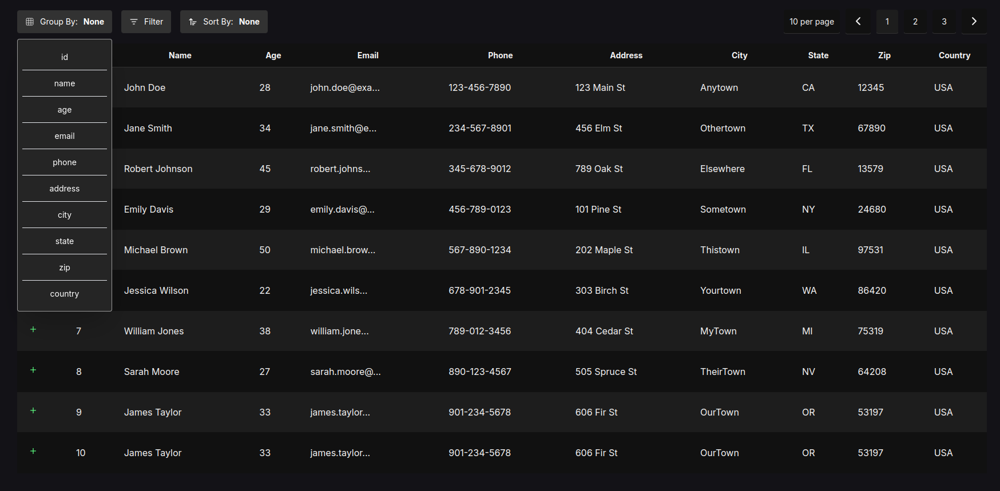
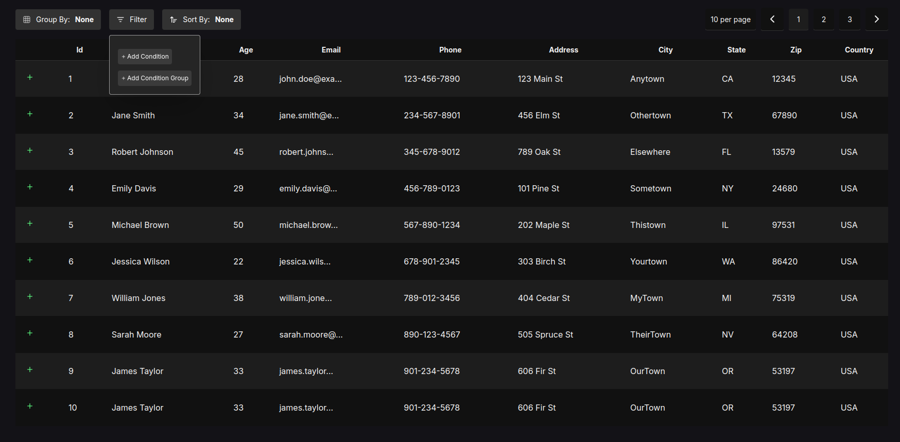
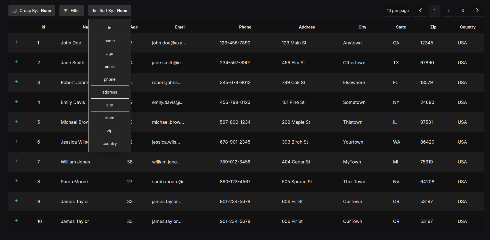

# Awesome Data View

- Group Function


- Filter Function


- Sort Function


```txt
// my note
https://github.com/nodeca/pako for compressing data in web workers

web component

template literals


responsive popup
```

> I will write a better documentation. For now, I am so busy with my work. 

- Example

```js
const dummyData = [
    {
        id: 1,
        name: "John Doe",
        age: 28,
        email: "john.doe@example.com",
        phone: "123-456-7890",
        address: "123 Main St",
        city: "Anytown",
        state: "CA",
        zip: "12345",
        country: "USA"
    },
    {
        id: 2,
        name: "Jane Smith",
        age: 34,
        email: "jane.smith@example.com",
        phone: "234-567-8901",
        address: "456 Elm St",
        city: "Othertown",
        state: "TX",
        zip: "67890",
        country: "USA"
    },
    {
        id: 3,
        name: "Robert Johnson",
        age: 45,
        email: "robert.johnson@example.com",
        phone: "345-678-9012",
        address: "789 Oak St",
        city: "Elsewhere",
        state: "FL",
        zip: "13579",
        country: "USA"
    },
    {
        id: 4,
        name: "Emily Davis",
        age: 29,
        email: "emily.davis@example.com",
        phone: "456-789-0123",
        address: "101 Pine St",
        city: "Sometown",
        state: "NY",
        zip: "24680",
        country: "USA"
    },
    {
        id: 5,
        name: "Michael Brown",
        age: 50,
        email: "michael.brown@example.com",
        phone: "567-890-1234",
        address: "202 Maple St",
        city: "Thistown",
        state: "IL",
        zip: "97531",
        country: "USA"
    },
    {
        id: 6,
        name: "Jessica Wilson",
        age: 22,
        email: "jessica.wilson@example.com",
        phone: "678-901-2345",
        address: "303 Birch St",
        city: "Yourtown",
        state: "WA",
        zip: "86420",
        country: "USA"
    },
    {
        id: 7,
        name: "William Jones",
        age: 38,
        email: "william.jones@example.com",
        phone: "789-012-3456",
        address: "404 Cedar St",
        city: "MyTown",
        state: "MI",
        zip: "75319",
        country: "USA"
    },
    {
        id: 8,
        name: "Sarah Moore",
        age: 27,
        email: "sarah.moore@example.com",
        phone: "890-123-4567",
        address: "505 Spruce St",
        city: "TheirTown",
        state: "NV",
        zip: "64208",
        country: "USA"
    },
    {
        id: 9,
        name: "James Taylor",
        age: 33,
        email: "james.taylor@example.com",
        phone: "901-234-5678",
        address: "606 Fir St",
        city: "OurTown",
        state: "OR",
        zip: "53197",
        country: "USA"
    },
    {
        id: 10,
        name: "James Taylor",
        age: 33,
        email: "james.taylor@example.com",
        phone: "901-234-5678",
        address: "606 Fir St",
        city: "OurTown",
        state: "OR",
        zip: "53197",
        country: "USA"
    },
    {
        id: 11,
        name: "Patricia Anderson",
        age: 44,
        email: "patricia.anderson@example.com",
        phone: "012-345-6789",
        address: "707 Redwood St",
        city: "TheirTown",
        state: "AZ",
        zip: "42086",
        country: "USA"
    },
];
import {AwesomeDataView, FilterWhere, SortBy, GroupBy, TruncateCell, Paginate, TableRenderer} from 'awesome-data-view';
let dataV = new AwesomeDataView
let filterWhere = new FilterWhere;
let sortBy = new SortBy
let groupBy = new GroupBy;
let truncateCell = new TruncateCell;
let paginate = new Paginate

// filterWhere.and('email', 'emily', 'contains')
paginate.pageSize(5)
truncateCell.column('email', 12);

dataV.pipelines([filterWhere, sortBy, paginate, groupBy, truncateCell])

let tableRenderer = TableRenderer.container(document.getElementById('data-view')).darkTheme().customTheme({
    cell: {
        border: 'none',
        // borderBottom: '0.5px solid #323232',
        borderBottom: '0.5px solid #111111',
        // background: 'white',
        padding: '20px',
        // color: '#2c2c2c',
    },
    table: {
        borderCollapse: 'collapse',
        width: '100%',
        // borderSpacing: '4px'
    },
    header: {
        // color: '#4f4343',
        // background: 'white',
        border: 'none',
        // outline: "0.1px solid #575757",
        borderBottom: '0.2px solid #323232',
        fontSize: '14px'
    }
})

const updateData = () => {
    tableRenderer.updateRows(dataV.process());
}

let leftFilterBox = document.getElementById('left-filter-box');
let rightFilterBox = document.getElementById('right-filter-box');
let footer = document.getElementById('footer');

leftFilterBox.appendChild(groupBy.render(Object.keys(dummyData[0]), function (option) {
    groupBy.column(option)
    updateData()

}, {
    color: '#ffffff',
    background: '#323232',
    border: 'none'
}, {
    color: 'white',
    background: '#252525',
    border: '1px solid #9d9d9d',
    marginTop: '10px'
}));

leftFilterBox.appendChild(filterWhere.render({
    color: '#ffffff',
    background: '#323232',
    border: 'none'
}, {
    color: '#ffffff',
    background: '#252525',
    border: '1px solid #9d9d9d',
    right: null,
    transformOrigin: 'top left',
    left: '0',
    marginTop: '10px'
}, () => {
    updateData()
}));

leftFilterBox.appendChild(sortBy.render(Object.keys(dummyData[0]), function (option) {
    sortBy.column(option)
    updateData()
}, {
    color: '#ffffff',
    background: '#323232',
    border: 'none'
}, {
    color: 'white',
    background: '#252525',
    border: '1px solid #9d9d9d',
    marginTop: '10px'
}))

// initialise data
let d = dummyData.concat(...dummyData.map((datum) => {
    let a = {...datum};
    a.id += 11;
    return a;
}));

rightFilterBox.appendChild(paginate.render(d.length, tableRenderer.theme.header))

paginate.onChange(async () => {
    tableRenderer.updateRows(await dataV.process());
})

tableRenderer.onClickCell((...params) => {
    // console.log('cell click', params)
})


tableRenderer.render(await dataV.data(d)
    .process());
// (new Exporter).xlsx(['test','d'])
```


- ## Truncate Cells

```js
import {TruncateCell, AwesomeDataView} from 'awesome-data-view'

let truncateCell = new TruncateCell;

let limit = 20;
let postfix = '***'
truncateCell.all(limit, postfix)

let dataV = new AwesomeDataView;

dataV.pipeline(truncateCell).data([{
    ...
}]).process()
```

- ## Add new column

